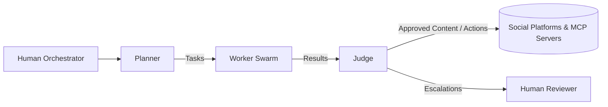

## Project Chimera – Architecture Strategy

### 1. Agent Pattern

- **Chosen pattern:** **Hierarchical Swarm (Planner → Worker → Judge)**, aligned with the SRS FastRender architecture.
- **Rationale:**
  - Matches the SRS definition of Planner, Worker, and Judge services and their queues.
  - Supports **massive parallelism** for content tasks (many Workers per campaign), which a simple sequential chain cannot handle at required scale.
  - Enables **role specialization**: Planners focus on strategy, Workers on execution, Judges on safety and quality.
  - Works naturally with **MCP-based tooling**, where Workers are the primary tool callers and Judges enforce policy (including commerce and safety).

---

### 2. Human-in-the-Loop (HITL) Safety Layer

- **HITL placement:** At the **Judge boundary**, before any irreversible or sensitive action is committed:
  - **Content publishing** (posts, replies, high-risk media).
  - **On-chain transactions** (payments, token deployment).
- **Flow:**
  1. Worker produces an action proposal (content or transaction).
  2. Judge scores confidence and evaluates safety/policy.
  3. If confidence is:
     - **High** and not sensitive → auto-approve.
     - **Medium** or low-risk-sensitive → queue for **HITL Review Interface**.
     - **Low** or policy-violating → reject and request re-plan / re-generation.
  4. Human reviewers use the Dashboard to **Approve / Reject / Edit** before final execution.
- **Reasoning:**
  - This mirrors the SRS NFRs: confidence-based routing plus mandatory human review for sensitive topics.
  - Keeps humans **out of the hot path** for routine safe content, but firmly in control of edge cases and high-risk decisions.

---

### 3. Database Choice for High-Velocity Video Metadata

- **Primary choice:** **SQL (PostgreSQL)** for structured video metadata, complemented by:
  - **Object storage** (e.g., S3-compatible) for raw media assets.
  - **Vector DB (Weaviate)** for semantic embeddings and content search.

#### Why SQL for video metadata?

- **Strong consistency and transactions:**
  - Campaigns, assets, and financial flows are tightly coupled; transactional integrity is important (e.g., correlating spend, engagement, and media).
- **Rich querying and joins:**
  - Typical queries: by campaign, agent, platform, time range, A/B variant, performance metrics.
  - Relational modeling simplifies analytics and reporting.
- **Maturity and ecosystem:**
  - PostgreSQL is already in the SRS as the transactional store, minimizing operational complexity.

#### Role of NoSQL (optional)

- Use **NoSQL** only where it clearly fits:
  - Extremely high-volume, append-only logs (e.g., per-frame analytics or raw event streams) could live in a columnar store or log system (ClickHouse, Bigtable, or Kafka + lakehouse).
  - For the **core “video asset metadata”** (IDs, URLs, campaign links, status, performance summaries), SQL is the default.

